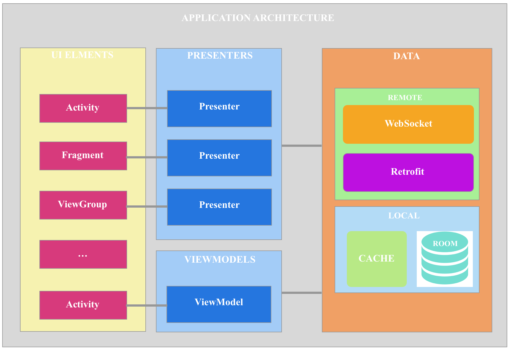

# Demo for 360Live Tech Sharing - Syncing Chat Profiles in 360Live
This repository is to demostrate the concepts, workflow and architecture we are currently using in 360Live application. Its purpose is to demo the concepts only. Therefore, we have faked some stuffs, such as WebSocket, REST API for easier to demo with standalone application.  

# Overall Application Architecture
  

# The Profile Syncing Workflow
  

  
## License

    Copyright (C) 2018 thuannv

    Licensed under the Apache License, Version 2.0 (the "License");
    you may not use this file except in compliance with the License.
    You may obtain a copy of the License at

       http://www.apache.org/licenses/LICENSE-2.0

    Unless required by applicable law or agreed to in writing, software
    distributed under the License is distributed on an "AS IS" BASIS,
    WITHOUT WARRANTIES OR CONDITIONS OF ANY KIND, either express or implied.
    See the License for the specific language governing permissions and
    limitations under the License.